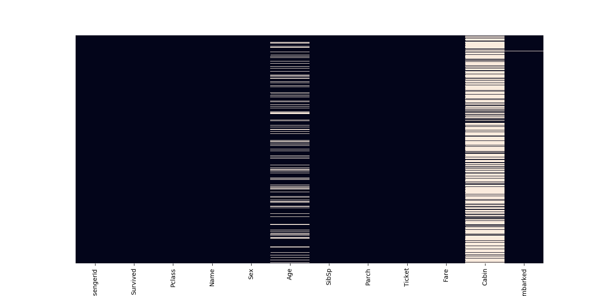

# Dataset Titanic e Machine Learning
Resolução do desafio <a href = "https://www.kaggle.com/c/titanic">Titanic: Machine Learning from Disaster</a>
proposto pela <a href="http://kaggle.com">Kaglle</a>. O desafio é baseado no famoso naufŕagio do gigantesco navio Titanic
que afundou no meio do Atlântico em 15/04/1912, matando 1502 dos 2224 passageiros.
O desafio fornece um dataset para treinamento ("train.csv") com 891 dados de passageiros, incluindo a informação se 
sobreviveram ou não, e um outro dataset para teste ("test.csv") com o objetivo de prever o destino de 418 passageiros, 
cujo a resposta se sobreviveram ou não é incerta.

## Pré-processamento dos dados
Ao analisar os datasets é verifcado que o primeiro desafio é completar os dados ausentes, como fica claro 
na imagem abaixo sobre os dados de treinamento. 


Para preencher os dados da coluna Age, é analisado o gráfico de idades conforme as classes de passageiros. 

Portanto, os dados serão preenchidas de acordo com a seguinte lógica:

````
def setAge(cols):
    Age = cols[0]
    Pclass = cols[1]
    if pd.isnull(Age):
        if Pclass == 1:
            return 37
        elif Pclass == 2:
            return 29
        else:
            return 24
    else:
        return Age
````

Como a quantidade de dados ausentes na coluna Cabin é grande, a coluna será apenas eliminada. 

Outra informação analisada é referente ao sexo dos passageiros.


A informação da coluna Sex pode ser "female" e "male", a coluna em questão será substituída 
pela coluna Male com informações binárias (0 e 1). Dessa forma se o passageiro tem a coluna Male = 0 sabemos automaticamente 
que é do sexo feminino. 

A coluna Embarked também é modificada. A coluna pode ter três informações ("Q", "S", "C"), é seguida a mesma lógica da coluna Sex,
é criado duas colunas "Q" e "S", com informações binárias.

## Processamento
Algumas colunas são desconsideradas para o treinamento do modelo, como por exemplo o nome dos passageiros.
O dados considerados para o treinamento são:
```
target = data_train['Survived'].values
features = data_train[["Pclass", "Age", "SibSp", "Parch", "Fare", "Male", "Q", "S"]].values
```
E para o teste:
````
features_test = data_test[["Pclass", "Age", "SibSp", "Parch", "Fare", "Male", "Q", "S"]].values
````

## Resultados
Os algoritmos considerados para o desafio e suas respectativas acurácias são:
<table>
    <thead>
        <th>Modelos</th>
        <th>Acurácia</th>
    </tead>
    <tbody>
        <tr>
            <td>SVM</td>
            <td>89.09</td>
        </tr>
        <tr>
            <td>KNN</td>
            <td>80.31</td>
        </tr>
        <tr>
            <td>Reg. Logística</td>
            <td>80.20</td>
        </tr>
    </tbody>
</table>

O modelo que teve melhor desempenho foi SVM com ~89% de acertos e é o modelo usado para as predições.
Um arquivo results.csv é gerado com o ID dos passageiros e a resposta da sobrevivência.
